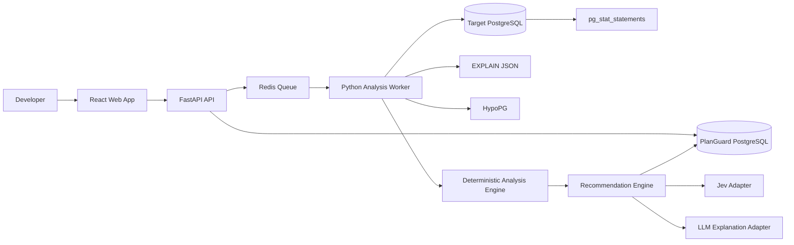
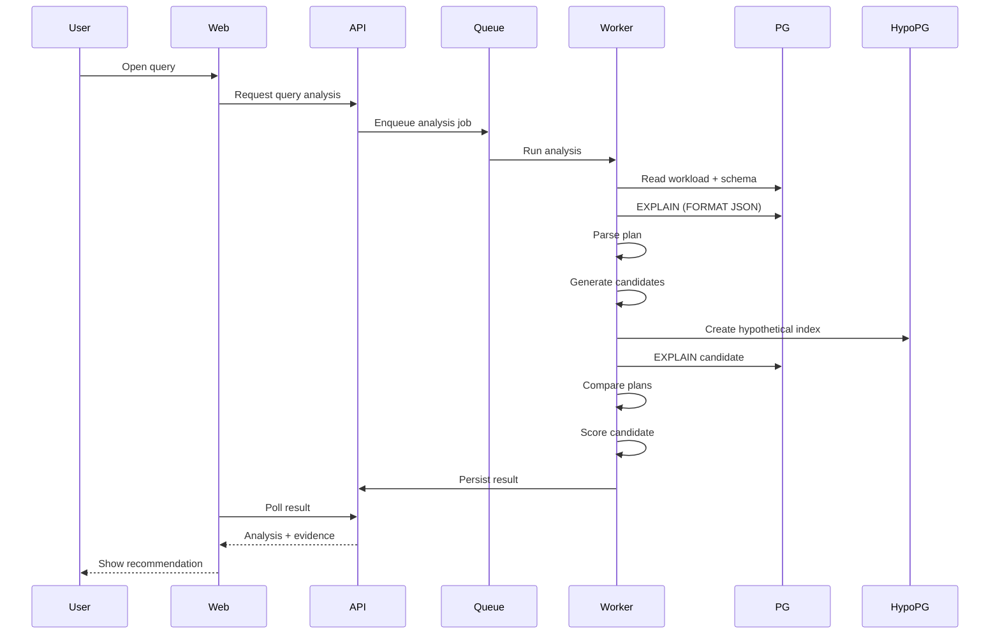
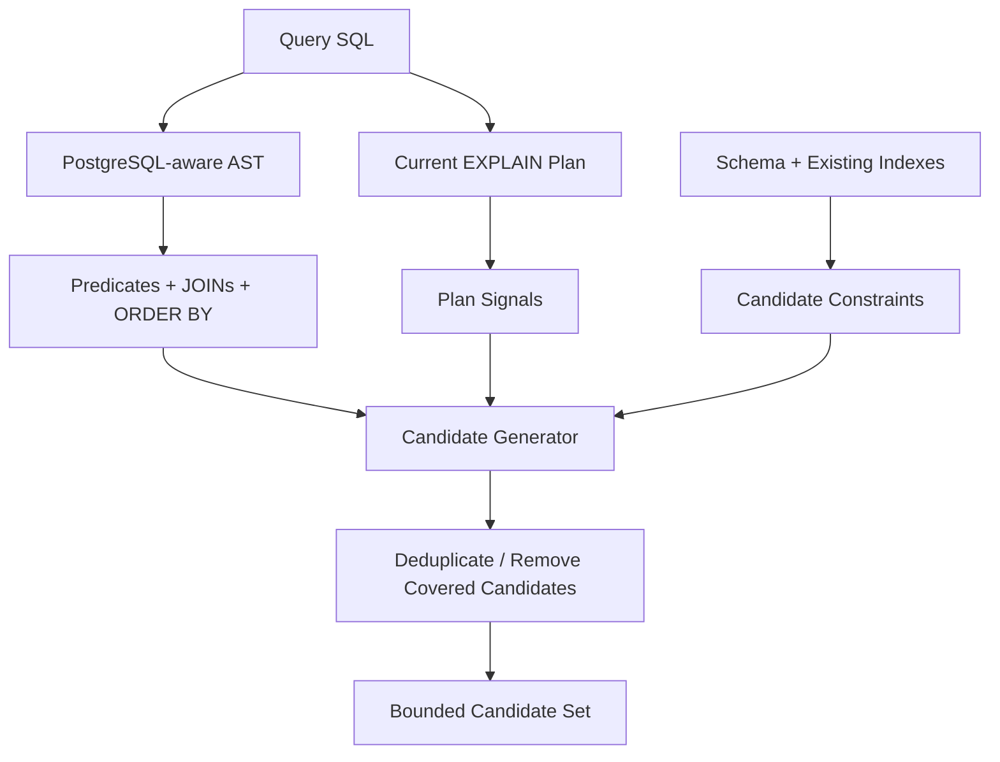
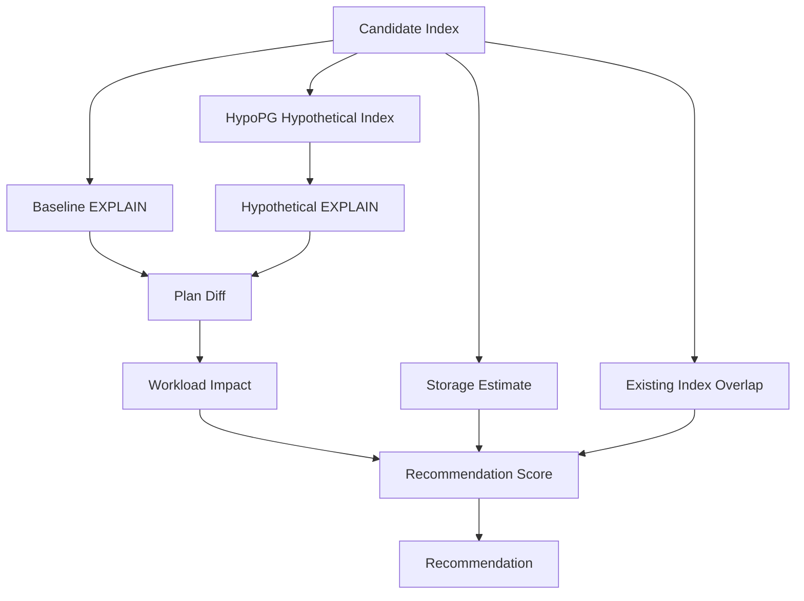

# PlanGuard — Product Requirements Document

## PostgreSQL Workload Analyzer & Index Experimentation Product

**Document status:** Implementation-ready
**Version:** 3.0
**Product stance:** Product-first; demo presentation is a consequence of product quality, not the product definition
**Primary stack:** React + TypeScript, Python + FastAPI, PostgreSQL
**Core database technologies:** `pg_stat_statements`, `EXPLAIN (FORMAT JSON)`, HypoPG
**Optional AI technologies:** TypeSafe Jev for bounded decisions; a generative AI model for explanations

---

# 1. Product Definition

PlanGuard is a developer product for PostgreSQL performance investigation and index experimentation.

It connects to a PostgreSQL environment, captures and persists workload snapshots from `pg_stat_statements`, identifies query fingerprints with meaningful workload impact, analyzes their PostgreSQL execution plans, generates a bounded set of plausible index candidates, tests those candidates through hypothetical planning, and presents the evidence needed for a developer to decide whether a candidate is worth implementing.

The product also generates the corresponding SQL migration as an output of the analysis.

PlanGuard does not automatically execute production database changes.

The product is intentionally focused. It solves one real engineering problem deeply:

> **Given a real PostgreSQL workload, determine whether an index is a useful change and show the evidence behind the conclusion.**

The core product loop is:

```text
Connect database
      |
      v
Capture workload snapshot
      |
      v
Rank high-impact query fingerprints
      |
      v
Analyze current EXPLAIN plan
      |
      v
Generate bounded index candidates
      |
      v
Simulate candidates with HypoPG
      |
      v
Compare plan + workload impact + trade-offs
      |
      v
Recommend, reject, or mark inconclusive
      |
      v
Generate migration SQL
```

Everything in the application should support this loop.

---

# 2. Original Problem Statement

The challenge supplied by the company is:

> **Autonomous Database Index Recommender & Slow Query Analyzer**
>
> Architecture suggestion: Go / Python + PostgreSQL EXPLAIN analyzer + React.
>
> Ingest `pg_stat_statements` query workloads, simulate synthetic workload cost, and generate `CREATE INDEX` migrations.

The product is allowed to make reasonable implementation and architecture choices as long as the solution remains materially aligned with the problem.

PlanGuard therefore retains all core problem requirements:

- PostgreSQL workload ingestion.
- Slow/high-impact query analysis.
- PostgreSQL execution-plan analysis.
- Index candidate generation.
- Hypothetical/synthetic evaluation.
- `CREATE INDEX` migration generation.
- React-based developer interface.
- Python implementation of the analysis backend.

The product does not need to become a generic observability platform or a fully autonomous database administrator.

---

# 3. Problem Being Solved

Developers often know that a PostgreSQL query is expensive but do not immediately know why it is expensive or whether adding an index is actually the right response.

The problem has several layers.

A query can be slow because PostgreSQL scans a large table, filters a large number of rows, performs an avoidable sort, chooses an expensive join strategy, or simply has a workload pattern for which a proposed index would have little overall value.

A single query can also be misleading. A query that takes several seconds but runs twice may matter less than a query that takes tens of milliseconds and executes hundreds of thousands of times.

Indexes also have trade-offs. They consume storage and must be maintained when indexed rows change. Adding every plausible index can therefore make a database worse rather than better.

The user needs a system that can answer:

```text
Which query matters?
Why is PostgreSQL executing it this way?
What index candidates are plausible?
What changes if each candidate exists?
Which candidate provides the strongest evidence?
What trade-offs come with it?
What SQL should I apply if I accept the recommendation?
```

---

# 4. Product Goal

The product goal is not to automatically modify databases.

The goal is to shorten the path between:

> “Something in PostgreSQL is slow.”

and:

> “I understand the cause, I tested a plausible index, I understand the trade-offs, and I have an executable migration.”

---

# 5. Product Principles

## 5.1 Evidence over assertion

Every recommendation must have a traceable evidence chain.

A recommendation should link back to:

```text
query fingerprint
  -> observed workload
  -> current plan
  -> candidate index
  -> hypothetical plan
  -> comparison
  -> scoring inputs
  -> recommendation outcome
```

## 5.2 PostgreSQL is the authority on PostgreSQL

The application must not pretend to be a replacement for the PostgreSQL planner.

PlanGuard uses PostgreSQL `EXPLAIN` output and planner behavior as authoritative database evidence.

## 5.3 Deterministic logic makes technical decisions

The core recommendation engine must work without an LLM.

This makes the product testable, reproducible, debuggable, and understandable.

## 5.4 AI explains or assists bounded decisions

AI is an enhancement, not a dependency for database correctness.

A generative model can explain technical evidence.

Jev can classify or route structured decisions where a bounded model adds value.

Neither is allowed to invent SQL or override PostgreSQL evidence.

## 5.5 Do not claim measured runtime from planner cost

Planner cost units and observed execution time are separate signals.

The UI and backend must store and display them separately.

## 5.6 Uncertainty must be visible

If the system lacks representative parameters, has stale statistics, cannot access a capability, or has only hypothetical evidence, the product must say so.

## 5.7 User remains in control

PlanGuard generates recommendations and migrations. It does not silently mutate production data or schema.

---

# 6. Target Users

## 6.1 Application / Backend Developer

Needs a practical answer to:

> “What is making this query expensive and what should I investigate first?”

The interface should translate planner behavior into understandable language while retaining access to the technical details.

## 6.2 Database / Performance Engineer

Needs:

- exact SQL;
- exact query metrics;
- current plan;
- candidate definitions;
- hypothetical plans;
- index overlap information;
- workload impact;
- generated migration;
- raw evidence where necessary.

PlanGuard should not hide advanced information from this user.

---

# 7. Product Scope

## 7.1 In Scope

The real product includes:

1. PostgreSQL connection management.
2. Database readiness checks.
3. Workload snapshot capture.
4. Query fingerprint explorer.
5. Query-detail analysis.
6. `EXPLAIN (FORMAT JSON)` plan collection.
7. Plan tree parsing.
8. Index-opportunity detection.
9. Candidate index generation.
10. Existing-index overlap analysis.
11. Hypothetical index simulation using HypoPG when available.
12. Candidate scoring.
13. Recommendation states.
14. Evidence presentation.
15. Optional Jev decision layer.
16. Optional LLM explanation layer.
17. Migration SQL generation.
18. Persistent analysis history.
19. Workload refresh and re-analysis.
20. Basic product telemetry and error reporting.

## 7.2 Explicitly Out of Scope for MVP

The MVP does not automatically:

- execute production migrations;
- perform autonomous rollback;
- clone customer databases into cloud environments;
- provide full APM functionality;
- rewrite SQL automatically;
- tune PostgreSQL configuration automatically;
- manage partitions automatically;
- optimize every PostgreSQL index type;
- manage billing or enterprise organizations.

These can become future modules only after the core product is stable.

---

# 8. Core Product Objects

The product is organized around persistent objects rather than temporary demo states.

## 8.1 Workspace

A workspace represents one database environment under analysis.

Fields include:

```text
id
name
environment_label
created_at
updated_at
status
```

## 8.2 Connection

Stores a secure reference to the target PostgreSQL database.

The database password or full connection URI must never be stored in plain text.

Fields include:

```text
id
workspace_id
host
port
database_name
username
credential_reference
ssl_mode
server_version
capability_status
created_at
updated_at
```

## 8.3 Workload Snapshot

A point-in-time capture of PostgreSQL workload statistics.

Fields include:

```text
id
workspace_id
captured_at
observation_window_start
observation_window_end
stats_reset_at
query_count
status
metadata
```

Each snapshot stores the relevant statistics required to reproduce the ranking calculation at that point in time.

## 8.4 Query Fingerprint

Represents a normalized query identity derived from PostgreSQL query identifiers and associated metadata.

Fields include:

```text
id
workspace_id
queryid
normalized_sql
current_database
role_name
first_seen_at
last_seen_at
```

## 8.5 Query Observation

Links a query fingerprint to a workload snapshot.

Fields include:

```text
id
snapshot_id
query_fingerprint_id
calls
planning_time
execution_time
mean_plan_time
mean_exec_time
min_exec_time
max_exec_time
rows
shared_blks_hit
shared_blks_read
shared_blks_dirtied
shared_blks_written
wal_bytes
parallel_workers_launched
```

Only columns actually available in the target PostgreSQL version should be populated.

## 8.6 Plan Snapshot

Stores an `EXPLAIN (FORMAT JSON)` result and a normalized representation of the plan.

Fields include:

```text
id
query_fingerprint_id
captured_at
plan_json
plan_hash
root_node_type
total_cost
plan_rows
planning_time
analysis_mode
```

## 8.7 Index Candidate

Represents one generated possible index.

Fields include:

```text
id
workspace_id
query_fingerprint_id
table_name
index_method
columns
sort_directions
include_columns
predicate
source_signals
generation_rule
estimated_size_bytes
overlap_status
```

MVP generation should primarily target B-tree candidates.

## 8.8 Experiment

Represents one comparison between current and hypothetical planning conditions.

Fields include:

```text
id
candidate_id
query_fingerprint_id
created_at
status
hypopg_available
before_plan_id
after_plan_json
before_cost
after_cost
before_rows
after_rows
before_sort_nodes
after_sort_nodes
plan_changed
storage_estimate_bytes
```

## 8.9 Recommendation

Stores the product's conclusion for a candidate.

Possible states:

```text
RECOMMENDED
REVIEW_REQUIRED
INCONCLUSIVE
REJECTED
```

Fields include:

```text
id
candidate_id
experiment_id
status
score
benefit_score
storage_penalty
write_penalty
overlap_penalty
evidence_quality
reason_codes
explanation
created_at
```

## 8.10 Migration Artifact

Stores generated SQL without executing it.

Fields include:

```text
id
recommendation_id
sql_text
rollback_sql_text
created_at
version
```

---

# 9. End-to-End Product Workflow

## 9.1 Connect

User creates a workspace and connects PostgreSQL.

## 9.2 Readiness Check

PlanGuard checks:

```text
PostgreSQL connectivity
server version
pg_stat_statements availability
query text access
schema metadata access
statistics access
HypoPG availability
```

## 9.3 Capture Workload

The user manually starts a snapshot or refreshes the current snapshot.

The product stores the observation rather than overwriting the previous one.

This allows analysis history to remain reproducible.

## 9.4 Rank Queries

The backend calculates workload-impact metrics and identifies query fingerprints worth investigating.

## 9.5 Query Investigation

User opens a query and sees:

```text
SQL
Workload evidence
Current plan
Plan interpretation
Index opportunity
Existing relevant indexes
```

## 9.6 Candidate Generation

The backend generates a bounded list of index candidates.

The user can inspect how each candidate was derived.

## 9.7 Hypothetical Experiment

PlanGuard creates a hypothetical index through HypoPG when available and requests a new `EXPLAIN (FORMAT JSON)` plan.

The hypothetical index is not a physical production index.

## 9.8 Compare

The user sees:

```text
Current plan
vs
Hypothetical plan
```

and the measured planner differences.

## 9.9 Recommendation

The deterministic engine produces an outcome from the available evidence.

Jev may optionally provide a secondary classification or review-routing signal.

## 9.10 Migration

The user can generate the SQL artifact.

No production change is executed automatically.

## 9.11 Re-analysis

When a new workload snapshot is captured, previous recommendations can be re-evaluated against the newer workload.

This gives PlanGuard product value beyond a one-time scan.

---

# 10. Frontend Information Architecture

The frontend is a React + TypeScript application.

Recommended structure:

```text
Application Shell
│
├── Workspaces
│   ├── Workspace Overview
│   ├── Workload
│   ├── Queries
│   ├── Query Detail
│   ├── Experiments
│   ├── Indexes
│   ├── Recommendations
│   └── Settings
│
└── Global Connection / Job Status
```

The application should preserve the selected workspace and make the current workspace visible throughout analysis pages.

---

# 11. Interface Specifications

## 11.1 Workspaces Screen

Purpose: select and manage analysis environments.

Interface elements:

- workspace list;
- workspace name;
- database environment label;
- connection state;
- last workload snapshot;
- number of open recommendations;
- button: `New Workspace`;
- button: `Open`.

A workspace should not require a demo dataset. Demo data is only a development fixture.

## 11.2 Database Connection Screen

Fields:

```text
Host
Port
Database
Username
Password / Credential
SSL Mode
```

Actions:

```text
Test Connection
Save Connection
Cancel
```

After testing, show capability results.

The user must be able to proceed with partial capabilities where safe.

## 11.3 Workspace Overview

The overview should present:

```text
Current workload snapshot
Queries analyzed
High-impact query count
Candidate index count
Recommended changes
Last analysis time
Capability warnings
```

The main work area should be a prioritized list of query opportunities.

Each row/card must provide enough context to answer:

```text
What is the query?
Why is it important?
What should I do next?
```

Primary action: `Investigate`.

## 11.4 Workload Screen

Display query fingerprints and workload observations.

Search and filtering must support:

```text
total execution time
mean execution time
call frequency
I/O
query type
index opportunity
```

The user can choose the snapshot used for analysis.

## 11.5 Query Detail Screen

Sections:

1. SQL.
2. Workload metrics.
3. Observation history.
4. Current execution plan.
5. Plan explanation.
6. Existing indexes on relevant relations.
7. Index opportunity.
8. Candidate actions.

Actions:

```text
Refresh Analysis
Generate Candidates
Open Experiment
View Raw EXPLAIN
```

## 11.6 Execution Plan Viewer

The plan viewer is a tree representation of PostgreSQL's JSON plan.

Each node should expose:

```text
Node Type
Relation
Startup Cost
Total Cost
Plan Rows
Actual Rows (when measured)
Filter
Index Cond
Join Cond
Sort Key
```

Users must be able to expand and collapse nodes.

The viewer should distinguish estimated information from measured information.

## 11.7 Candidate Index Screen

Show every candidate as a structured object rather than plain SQL.

Example representation:

```text
Table
orders

Method
B-tree

Columns
customer_id
status
created_at DESC

Reason
WHERE equality + WHERE equality + ORDER BY

Existing overlap
Partial overlap with idx_orders_customer
```

Actions:

```text
Run Experiment
Compare
Reject Candidate
```

## 11.8 Experiment Screen

This screen is the core working area of the product.

It must provide:

```text
Candidate definition
Current plan
Hypothetical plan
Plan diff
Cost comparison
Estimated rows comparison
Sort-node comparison
Index-size estimate
Affected-query count
```

Actions:

```text
Run Experiment
Run Again
Save Result
Create Recommendation
```

## 11.9 Recommendation Screen

Display:

```text
Recommendation status
Candidate index
Supporting query
Supporting workload
Experiment result
Trade-offs
Existing-index overlap
Evidence quality
Reason codes
Generated SQL
```

Actions:

```text
Generate Migration
Mark Reviewed
Reject
Regenerate Analysis
```

## 11.10 Index Inventory Screen

Display current indexes grouped by table.

For each index show:

```text
name
columns
method
size
usage information where available
overlap with current recommendations
```

This interface is primarily used to prevent the recommendation engine from treating already-covered access paths as new opportunities.

## 11.11 Analysis History Screen

Show snapshots, experiments, and recommendation decisions over time.

Users should be able to answer:

> “What did PlanGuard know when it made this recommendation?”

The historical state should therefore remain immutable for completed snapshots and experiments.

## 11.12 Migration Artifact Interface

Display generated SQL in a code-oriented interface.

Provide:

```text
SQL
rollback SQL
index name
source recommendation
created timestamp
```

Actions:

```text
Copy SQL
Download SQL
```

No execute button is required in MVP.

---

# 12. Workload Ingestion

PlanGuard reads `pg_stat_statements` through a restricted database connection.

The ingestion query should collect the columns needed for ranking and later analysis.

The exact query must be version-aware because `pg_stat_statements` columns differ between PostgreSQL releases.

The collector should inspect the available columns before selecting version-specific fields.

The collector must never mutate `pg_stat_statements` as part of normal analysis.

PlanGuard should treat a workload snapshot as an observation interval, not merely as a raw point measurement.

When two snapshots exist, the application can calculate deltas such as:

```text
calls_delta
execution_time_delta
rows_delta
shared_blks_read_delta
shared_blks_hit_delta
wal_bytes_delta
```

This is useful for understanding workload activity during a period.

---

# 13. Query Ranking

The first ranking question is:

> Which query fingerprints deserve investigation?

The system should not sort solely by mean latency.

The baseline ranking should consider:

```text
Total execution time
Call frequency
Mean execution time
I/O pressure
Rows processed
Plan characteristics
```

A simple MVP ranking model can be:

```text
workload_impact =
    normalized(total_execution_time)
    * frequency_factor
    * plan_risk_factor
```

The exact coefficients should be configuration rather than hard-coded magic numbers.

For snapshot-to-snapshot analysis, workload deltas should be used where available.

The ranking engine must return the individual feature contributions so that the UI can explain why a query was prioritized.

---

# 14. EXPLAIN Collection

PlanGuard uses machine-readable `EXPLAIN (FORMAT JSON)` output because the backend must parse plan nodes programmatically.

The current plan collector should default to a non-executing plan inspection path.

Where actual runtime analysis is explicitly enabled in a safe environment, the product can use `EXPLAIN (ANALYZE, BUFFERS, FORMAT JSON)` with appropriate safeguards.

The product must never execute arbitrary user SQL with `EXPLAIN ANALYZE` against production as part of the default workflow.

The plan collector should store both:

```text
raw JSON
normalized plan representation
```

The normalized representation should be stable enough for comparison across experiments.

---

# 15. Plan Analysis Engine

The plan parser should recursively traverse the JSON plan tree.

For every node, extract:

```text
node_type
relation_name
schema_name
startup_cost
total_cost
plan_rows
actual_rows when available
filter
index_cond
recheck_cond
join_filter
sort_key
```

The analyzer should derive summary signals:

```text
contains_seq_scan
contains_index_scan
contains_bitmap_scan
contains_sort
contains_nested_loop
contains_hash_join
contains_merge_join
largest_scan_relation
estimated_rows_removed_by_filter
```

MVP index-opportunity signals should focus on:

```text
large sequential scan
selective WHERE predicates
JOIN predicates on relations with large scans
ORDER BY after filtering
LIMIT with ordering
```

Other problems such as join reordering, statistics problems, or query rewrites can be reported as non-index observations but should not automatically generate index candidates in MVP.

---

# 16. Candidate Index Generation

Candidate generation is deterministic.

The generator takes:

```text
SQL structure
plan signals
schema metadata
existing indexes
workload context
```

and generates a bounded candidate set.

MVP supports B-tree indexes first.

Candidate generation should consider three major patterns.

## 16.1 Equality predicates

For:

```sql
WHERE customer_id = $1
AND status = $2
```

generate candidates such as:

```text
(customer_id)
(customer_id, status)
(status, customer_id)
```

The engine then removes candidates that are dominated by better-supported combinations.

## 16.2 Equality + range

For:

```sql
WHERE customer_id = $1
AND created_at >= $2
```

generate:

```text
(customer_id, created_at)
```

## 16.3 Equality + ordering

For:

```sql
WHERE customer_id = $1
ORDER BY created_at DESC
LIMIT 20
```

generate:

```text
(customer_id, created_at DESC)
```

The generator should not create arbitrary permutations of all columns.

Configuration limits:

```text
max_candidates_per_query = 8
max_index_columns = 3
supported_method = btree
```

These values must be configurable.

---

# 17. Existing Index Analysis

Before a candidate is evaluated, PlanGuard inspects existing indexes on the affected relation.

The engine should classify the relationship as:

```text
NONE
PARTIAL_OVERLAP
FULLY_COVERED
DUPLICATE
POTENTIALLY_REDUNDANT
```

A candidate that is already fully covered should not receive a positive recommendation.

For example, if an existing index begins with:

```text
(customer_id, status)
```

and a candidate is:

```text
(customer_id)
```

the candidate should be identified as covered by the existing index for the access pattern being evaluated.

The exact redundancy policy should be conservative. Prefix relationships alone are not always sufficient to prove that an index is globally redundant.

Therefore, the UI should communicate:

> “Existing index likely covers this access pattern.”

rather than making an unconditional database-wide claim unless the evidence supports it.

---

# 18. HypoPG Experiment Engine

If HypoPG is available, the experiment worker executes the experiment in an isolated database connection.

The worker must create the hypothetical index, run the requested `EXPLAIN (FORMAT JSON)`, collect the resulting plan, collect the hypothetical index size estimate when supported, and then clear the hypothetical index state before releasing the connection.

The worker must never execute `EXPLAIN ANALYZE` against a hypothetical index because hypothetical indexes do not physically exist.

The experiment result must record whether HypoPG was available.

If HypoPG is unavailable, the experiment must not pretend that hypothetical planning occurred.

Instead, the recommendation should state that only non-hypothetical analysis is available.

---

# 19. Plan Comparison Engine

The comparison engine should calculate:

```text
before_total_cost
after_total_cost
cost_reduction_ratio
before_plan_rows
after_plan_rows
scan_type_change
sort_node_change
join_strategy_change
plan_hash_changed
```

Example:

```text
Before
Seq Scan -> Sort -> Limit

After
Index Scan -> Limit
```

The result must be stored as structured data rather than as only a text explanation.

The UI can then generate multiple views from the same evidence.

---

# 20. Candidate Workload Impact

A candidate should not be evaluated only against one query.

The engine should identify other query fingerprints likely to use the same candidate index structure.

MVP matching can use schema/table plus predicate/order column overlap.

For each related query, run a hypothetical experiment only when the candidate is within the configured experiment budget.

The aggregate candidate impact can be represented as:

```text
aggregate_benefit =
    Σ(query_weight × cost_reduction_ratio)
```

where `query_weight` is derived from observed workload impact.

The UI must expose the individual contributing queries instead of displaying only the aggregate score.

---

# 21. Candidate Cost Model

Candidate scoring must account for negative consequences.

The MVP cost model uses:

```text
storage_penalty
write_activity_penalty
overlap_penalty
complexity_penalty
```

Storage estimate should use HypoPG's estimated relation size when available.

Write activity can be approximated using changes in insert/update/delete statistics from workload snapshots when available.

The product should call these values estimates.

It must not present them as exact future production costs.

---

# 22. Recommendation Engine

The recommendation engine combines observed workload evidence, plan changes, candidate coverage, and estimated trade-offs.

The engine outputs:

```text
status
score
benefit_score
penalty_score
evidence_quality
reason_codes
```

A conceptual score is:

```text
recommendation_score =
    benefit_score
    - storage_penalty
    - write_penalty
    - overlap_penalty
    - complexity_penalty
```

This formula is a product heuristic, not a PostgreSQL metric.

The system must preserve all component values.

The UI should allow the user to inspect why a candidate received its outcome.

---

# 23. Recommendation States

## RECOMMENDED

Strong evidence exists that the candidate materially improves one or more important queries and no major negative signal invalidates it.

## REVIEW_REQUIRED

The candidate looks promising but evidence or trade-offs require human inspection.

Examples:

```text
large storage estimate
high write activity
multiple overlapping indexes
insufficient cross-query evidence
```

## INCONCLUSIVE

The system cannot establish enough evidence to make a useful recommendation.

Examples:

```text
HypoPG unavailable
statistics stale or incomplete
no representative workload
ambiguous query structure
```

## REJECTED

The candidate does not show enough benefit or is materially dominated by another candidate.

---

# 24. Evidence Model

Every recommendation must expose an evidence summary.

The summary should distinguish:

### Observed facts

Examples:

```text
84,120 calls observed
412 ms mean execution time
34.6 hours total execution time
large sequential scan
```

### Derived analysis

Examples:

```text
candidate affects customer_id + status predicates
candidate also matches ORDER BY
candidate overlaps existing index
```

### Hypothetical evidence

Examples:

```text
plan changed
cost reduced
sort removed
estimated rows changed
```

### AI interpretation

Examples:

```text
human-readable explanation of the above evidence
```

The UI should never merge these into one ambiguous “AI result.”

---

# 25. Jev Integration

Jev is optional and must remain behind a feature flag.

The primary product must function correctly with Jev disabled.

Jev is appropriate for bounded application decisions such as:

```text
Should this recommendation enter deeper review?
Does this recommendation need additional evidence?
Which review path should this candidate enter?
```

Jev should receive structured evidence such as:

```json
{
  "query_calls": 84120,
  "total_exec_time_ms": 3460000,
  "cost_reduction_ratio": 0.99,
  "estimated_index_size_mb": 420,
  "write_activity_level": "medium",
  "existing_overlap": "partial",
  "cross_query_beneficiaries": 7,
  "hypopg_available": true
}
```

A suitable Jev request might classify the review path:

```text
NORMAL_REVIEW
ADDITIONAL_VALIDATION
HUMAN_REVIEW
```

Jev must not:

- generate SQL;
- determine PostgreSQL planner behavior;
- replace candidate generation;
- directly execute migrations;
- override deterministic safety checks.

If Jev is unavailable, the deterministic review policy remains the source of truth.

---

# 26. Generative AI Integration

A conventional generative model is optional.

Primary use case:

> Convert verified structured evidence into a technical explanation that is easier for developers to understand.

Input should be structured evidence, not raw uncontrolled database credentials.

The prompt should include:

```text
query SQL
current plan summary
candidate index
hypothetical plan summary
workload metrics
existing-index information
limitations
```

The model response must be treated as explanatory text, not as a source of truth.

The UI should label AI-generated explanations accordingly.

If the AI provider fails, PlanGuard must fall back to deterministic explanation templates.

---

# 27. AI Safety Boundary

The AI layer must never receive:

- database passwords;
- connection strings containing credentials;
- unnecessary user data;
- full database dumps.

The backend should send the minimum technical evidence required for explanation or bounded classification.

The migration SQL should be generated deterministically from the candidate object, not by asking a model to invent SQL.

---

# 28. Migration Generation

Migration generation is deterministic.

For a validated B-tree candidate the generator should produce SQL such as:

```sql
CREATE INDEX CONCURRENTLY IF NOT EXISTS
idx_orders_customer_status_created_at
ON public.orders
USING btree (customer_id, status, created_at DESC);
```

The exact SQL must be generated from the structured candidate object.

Identifier names must be sanitized and collision-safe.

The migration artifact should also contain a generated rollback statement where a safe inverse is known:

```sql
DROP INDEX CONCURRENTLY IF EXISTS
public.idx_orders_customer_status_created_at;
```

The product must clearly label this as generated SQL and must not execute it automatically.

---

# 29. Database Security

PlanGuard connects to external PostgreSQL instances.

Security therefore has priority over convenience.

The application must:

- use TLS where supported;
- avoid logging passwords and connection URIs;
- use restricted database credentials;
- use short-lived worker connections where practical;
- isolate target-database connection handling from the web process where practical;
- sanitize SQL and identifiers;
- enforce statement timeouts for analysis operations;
- prevent arbitrary query execution through user-controlled API parameters;
- store credentials through an encrypted secret-reference mechanism.

The recommended database role for the target database should have only the permissions necessary to inspect statistics, schema metadata, and run non-destructive planning operations.

HypoPG should be installed on a dedicated analysis or non-production environment where possible.

---

# 30. PostgreSQL Capability Detection

The product must not assume every PostgreSQL environment has every capability.

Capability detection should include:

```text
postgresql_version
pg_stat_statements_enabled
query_text_access
schema_metadata_access
statistics_access
hypopg_available
```

The workspace should display capability status and explain consequences.

Example:

```text
HypoPG unavailable.

Candidate generation remains available.
Hypothetical plan comparison is unavailable.
Recommendations will be marked lower-confidence until validated elsewhere.
```

---

# 31. Background Job Architecture

Long-running operations must not block FastAPI request handlers.

Use:

```text
FastAPI
   |
   +--> PostgreSQL application database
   |
   +--> Redis queue
             |
             +--> Worker
                    |
                    +--> Target PostgreSQL
                    +--> EXPLAIN analyzer
                    +--> HypoPG experiments
                    +--> Recommendation engine
                    +--> Jev / LLM adapters
```

Recommended queue technology:

```text
RQ + Redis
```

RQ is sufficient for the MVP and keeps the worker model simpler than introducing a larger distributed-task framework.

Job types:

```text
CAPTURE_WORKLOAD
ANALYZE_QUERY
GENERATE_CANDIDATES
RUN_EXPERIMENT
BUILD_RECOMMENDATION
GENERATE_EXPLANATION
REFRESH_WORKSPACE
```

Every job must have:

```text
id
workspace_id
job_type
status
created_at
started_at
completed_at
error_code
error_message
```

---

# 32. Backend Technology Stack

## API

```text
Python 3.12+
FastAPI
Uvicorn
Pydantic v2
```

## Database access

```text
SQLAlchemy 2.x
psycopg 3
asyncpg where asynchronous direct access is useful
Alembic
```

Prefer one consistent PostgreSQL driver strategy in production. The application may use `psycopg` as the default driver and only introduce another driver if a measured need exists.

## PostgreSQL analysis

```text
PostgreSQL EXPLAIN JSON
pg_stat_statements
HypoPG
pglast or equivalent PostgreSQL-aware parser
```

The parser should use a PostgreSQL-aware grammar so that candidate generation does not depend on fragile string manipulation.

## Validation and testing

```text
pytest
pytest-asyncio
httpx
Testcontainers for PostgreSQL integration tests
```

## AI integrations

```text
TypeSafe Python SDK for Jev, behind an adapter interface
Provider-specific LLM client, behind an explanation interface
```

---

# 33. Frontend Technology Stack

```text
React
TypeScript
Vite
React Router
TanStack Query
Zod
React Hook Form
```

Optional component library:

```text
shadcn/ui
```

The product requirement does not prescribe visual styling. The implementation team may choose the component system they can work with fastest.

The frontend must be driven by backend state and should not contain recommendation logic.

---

# 34. Frontend State Model

Server state should be managed through TanStack Query.

Local UI state should be used for:

```text
selected query
selected candidate
expanded plan nodes
filters
modal state
```

The frontend must never calculate final recommendation scores independently from the backend.

The backend is the source of truth for analysis results.

---

# 35. Application API

Base path:

```text
/api/v1
```

## Workspaces

```http
POST /workspaces
GET /workspaces
GET /workspaces/{workspace_id}
PATCH /workspaces/{workspace_id}
DELETE /workspaces/{workspace_id}
```

## Connections

```http
POST /workspaces/{workspace_id}/connection/test
POST /workspaces/{workspace_id}/connection
GET /workspaces/{workspace_id}/connection/status
PATCH /workspaces/{workspace_id}/connection
```

## Workload

```http
POST /workspaces/{workspace_id}/snapshots
GET /workspaces/{workspace_id}/snapshots
GET /workspaces/{workspace_id}/snapshots/{snapshot_id}
POST /workspaces/{workspace_id}/refresh
```

## Queries

```http
GET /workspaces/{workspace_id}/queries
GET /workspaces/{workspace_id}/queries/{query_id}
GET /workspaces/{workspace_id}/queries/{query_id}/observations
GET /workspaces/{workspace_id}/queries/{query_id}/plan
POST /workspaces/{workspace_id}/queries/{query_id}/analyze
```

## Candidates

```http
POST /workspaces/{workspace_id}/queries/{query_id}/candidates
GET /workspaces/{workspace_id}/queries/{query_id}/candidates
GET /candidates/{candidate_id}
```

## Experiments

```http
POST /experiments
GET /experiments/{experiment_id}
POST /experiments/{experiment_id}/run
```

## Recommendations

```http
GET /workspaces/{workspace_id}/recommendations
GET /recommendations/{recommendation_id}
POST /recommendations/{recommendation_id}/refresh
POST /recommendations/{recommendation_id}/migration
```

## Indexes

```http
GET /workspaces/{workspace_id}/indexes
GET /workspaces/{workspace_id}/tables/{table_name}/indexes
```

## Jobs

```http
GET /jobs/{job_id}
```

The API must return job identifiers for long-running operations.

---

# 36. API Response Principles

API responses must be stable and typed.

Long-running operations should return:

```json
{
  "job_id": "...",
  "status": "QUEUED"
}
```

The frontend then polls the job endpoint or uses server-sent events if implemented.

Analysis responses should include both result data and evidence metadata.

Example:

```json
{
  "query_id": "q_123",
  "impact": {
    "calls": 84120,
    "mean_exec_time_ms": 412.0,
    "total_exec_time_ms": 3460000
  },
  "plan_summary": {
    "root_node": "Limit",
    "contains_seq_scan": true,
    "contains_sort": true
  },
  "evidence": {
    "source": "postgresql"
  }
}
```

---

# 37. Internal Service Boundaries

The Python backend should be organized around domain modules rather than HTTP endpoints.

Recommended modules:

```text
app/
  api/
  core/
  db/
  domains/
    workspaces/
    connections/
    workload/
    queries/
    plans/
    indexes/
    experiments/
    recommendations/
    migrations/
  analysis/
    workload_ranker.py
    explain_parser.py
    candidate_generator.py
    index_overlap.py
    experiment_runner.py
    plan_diff.py
    scoring.py
  ai/
    jev_adapter.py
    llm_explainer.py
    policies.py
  workers/
  security/
  schemas/
```

The critical rule is that `analysis/` must not depend on FastAPI request objects.

This makes the analysis engine testable independently of the API layer.

---

# 38. Core Interfaces

Define interfaces so AI providers and future analysis implementations can be replaced without changing domain logic.

Conceptual interfaces:

```python
class RecommendationClassifier(Protocol):
    async def classify(self, evidence: RecommendationEvidence) -> Decision:
        ...
```

```python
class ExplanationProvider(Protocol):
    async def explain(self, evidence: ExplanationEvidence) -> str:
        ...
```

```python
class HypotheticalIndexProvider(Protocol):
    async def simulate(self, candidate: IndexCandidate, query: Query) -> ExperimentResult:
        ...
```

This lets Jev, a fallback heuristic, or another model occupy the same interface.

---

# 39. Plan Diff Data Structure

The backend should normalize plan changes into structured data.

Example:

```json
{
  "plan_changed": true,
  "scan_change": {
    "before": "Seq Scan",
    "after": "Index Scan"
  },
  "cost": {
    "before": 450120.0,
    "after": 2840.0,
    "reduction_ratio": 0.9937
  },
  "sort": {
    "before": 1,
    "after": 0
  },
  "rows": {
    "before": 18200000,
    "after": 120
  }
}
```

The frontend uses this structure to render the comparison.

---

# 40. Recommendation Reason Codes

The scoring engine should produce machine-readable reasons.

Example values:

```text
HIGH_TOTAL_EXECUTION_TIME
HIGH_CALL_FREQUENCY
SEQ_SCAN_ON_LARGE_RELATION
FILTER_MATCH
ORDERING_MATCH
PLAN_COST_REDUCTION
SORT_REMOVED
MULTI_QUERY_BENEFIT
EXISTING_INDEX_OVERLAP
HIGH_STORAGE_COST
HIGH_WRITE_ACTIVITY
LOW_EVIDENCE
HYPOPG_UNAVAILABLE
```

The UI can map these to human-readable explanations.

---

# 41. Error Handling

Failures should be domain-specific rather than generic.

Examples:

```text
DATABASE_UNREACHABLE
AUTHENTICATION_FAILED
SSL_CONFIGURATION_ERROR
PG_STAT_STATEMENTS_UNAVAILABLE
QUERY_TEXT_PERMISSION_DENIED
SCHEMA_ACCESS_DENIED
EXPLAIN_FAILED
HYPERPG_UNAVAILABLE
HYPOTHETICAL_INDEX_FAILED
STATISTICS_STALE
QUERY_UNSUPPORTED
AI_PROVIDER_UNAVAILABLE
```

The UI should explain what the user can do next.

A worker failure must not corrupt a previously completed experiment.

---

# 42. Safety Rules for Database Operations

Default database operations are read-only.

Allowed default operations include:

```text
SELECT against metadata views
SELECT against pg_stat_statements
EXPLAIN
```

HypoPG operations are allowed only in the configured analysis environment.

Production migration execution is explicitly disabled in MVP.

If a future feature introduces execution, it must require explicit approval and additional safety controls.

---

# 43. Statistics Freshness

PlanGuard must expose whether planner statistics may be stale.

The system should inspect available table statistics metadata and recent analyze activity where available.

When the system has reason to suspect stale statistics, it should reduce evidence quality and surface a warning.

It must not silently attribute every poor plan to missing indexes.

---

# 44. Parameter Handling

`pg_stat_statements` normalizes query structures and does not provide a complete historical parameter trace for each execution.

Therefore PlanGuard must treat query parameters carefully.

For plan generation, use a generic planning path whenever possible.

Where representative parameter values are necessary, support an explicit source designation:

```text
GENERIC
USER_PROVIDED
SYNTHETIC
```

The analysis record must store which mode was used.

The interface must show this provenance.

---

# 45. Synthetic Workload Support

The challenge explicitly mentions simulated synthetic workload cost.

MVP synthetic support should remain bounded.

The system may generate representative parameter scenarios using database statistics and user-provided examples.

It should not attempt to recreate an entire production workload distribution.

Synthetic scenarios should be clearly labeled as synthetic.

A useful initial design is:

```text
representative value set
        |
        +--> baseline EXPLAIN
        +--> candidate EXPLAIN
        |
        +--> compare
```

This supplements, rather than replaces, `pg_stat_statements` observations.

---

# 46. Product-Level Search and Filtering

Global search is not required in MVP.

Within a workspace, users must be able to filter by:

```text
query text
query id
relation
recommendation status
experiment status
snapshot
```

The filter state should be reflected in URL query parameters where practical so that a developer can bookmark or share an analysis view.

---

# 47. Product Telemetry

PlanGuard should record product events that help the team understand usage without collecting sensitive database contents.

Useful events:

```text
workspace_created
connection_tested
snapshot_started
snapshot_completed
query_opened
candidate_generated
experiment_started
experiment_completed
recommendation_viewed
migration_generated
```

Do not transmit raw customer SQL to product analytics unless the user explicitly enables such a feature.

---

# 48. Testing Strategy

Testing is a major part of the product because recommendations must be reproducible.

## Unit Tests

Cover:

```text
workload ranking
SQL AST extraction
candidate generation
candidate deduplication
existing-index overlap
plan parsing
plan diff
scoring
migration generation
Jev adapter behavior
AI fallback behavior
```

## Integration Tests

Use disposable PostgreSQL instances with Testcontainers.

Test:

```text
pg_stat_statements ingestion
EXPLAIN JSON collection
HypoPG experiment flow
index metadata extraction
snapshot persistence
```

## End-to-End Tests

At minimum:

```text
connect fixture database
capture workload
open slow query
generate candidate
simulate candidate
create recommendation
create migration
```

## Failure Tests

Explicitly test:

```text
HypoPG missing
pg_stat_statements missing
invalid credentials
stale statistics warning
long-running EXPLAIN
worker crash
AI timeout
Jev timeout
```

---

# 49. Demo Dataset as a Development Fixture

A seeded PostgreSQL database should exist in the repository only as a development and testing fixture.

It is not part of the product's user-facing definition.

The fixture should contain:

```text
users
orders
order_items
products
payments
events
```

Seed enough rows to produce meaningful plans.

Create a workload generator that repeatedly executes known queries so the team can reproduce the analysis locally.

The fixture should deliberately contain a small number of indexing problems, such as:

```text
filter without supporting index
filter + order without compound index
partially overlapping indexes
```

This supports deterministic development and automated testing.

---

# 50. Local Development Architecture

Use Docker Compose for local development.

Services:

```text
frontend
api
worker
app-postgres
redis
fixture-postgres
```

The two PostgreSQL databases are intentionally separate:

```text
app-postgres
= stores PlanGuard data

fixture-postgres
= acts as a target PostgreSQL environment for development/testing
```

This separation reduces accidental mixing of application data and target-database test data.

---

# 51. Environment Configuration

Required environment variables should include:

```text
DATABASE_URL
REDIS_URL
APP_ENCRYPTION_KEY
ALLOWED_ORIGINS
JEV_ENABLED
TYPESAFE_API_KEY
LLM_ENABLED
LLM_API_KEY
```

The target database credentials must not be committed to source control.

Use `.env.example` with placeholder values.

---

# 52. Observability of the Product Itself

The backend should produce structured logs.

Log fields should include:

```text
timestamp
request_id
workspace_id
job_id
operation
status
duration_ms
error_code
```

Never log:

```text
database password
full connection URI with credentials
API keys
raw secret values
```

SQL logging should default to query identifiers or redacted SQL rather than full raw statements.

---

# 53. Performance Requirements

The product is an analysis application, not a latency-critical request router.

Interactive page requests should generally return quickly when reading persisted analysis.

Long operations must run asynchronously.

Expected UX behavior:

```text
Page read:
sub-second to a few seconds depending on dataset

Workload capture:
background job

Candidate generation:
background job for large workloads

Hypothetical experiments:
background job
```

No request should remain blocked while a potentially long database analysis runs.

---

# 54. Scalability Boundaries

MVP is intended for small-to-medium PostgreSQL environments.

Reasonable initial target:

```text
up to 10,000 query fingerprints per workspace snapshot
up to 100 high-priority queries per analysis cycle
up to 8 candidates per query
```

These are product limits, not PostgreSQL limits.

The limits must be configurable.

At larger scale, future work can introduce:

```text
incremental analysis
sampling
candidate caching
distributed workers
```

---

# 55. Idempotency

Workload snapshot operations must be idempotent where possible.

An analysis job should not create duplicate experiments if the same candidate/query/snapshot combination has already been successfully analyzed.

Candidate identity should be derived from a normalized representation of:

```text
table
method
columns
sort directions
include columns
predicate
```

This allows the backend to deduplicate equivalent candidates.

---

# 56. Caching

MVP caching should focus on expensive deterministic operations.

Cache keys can include:

```text
query_fingerprint
plan input
candidate definition
schema signature
```

A schema change should invalidate affected plan/candidate caches.

The product should not cache a hypothetical plan indefinitely because planner behavior depends on schema and statistics.

---

# 57. Schema Change Awareness

The workspace should keep a lightweight schema signature.

When a new snapshot shows a relevant schema change, previously stored experiments should be marked:

```text
STALE
```

rather than silently presented as current.

Relevant changes include:

```text
new index
removed index
table definition change
column type change
```

---

# 58. API Authorization Model

For MVP, workspace ownership can be simple.

Every API operation should verify that the authenticated user can access the workspace.

Even if a hackathon build begins with a single user account, the domain model should keep `owner_id` or an equivalent authorization boundary so the product can become multi-user later without a rewrite.

---

# 59. Migration Naming Rules

Generated index names must be deterministic and bounded in length.

Suggested pattern:

```text
idx_{table}_{column1}_{column2}_{short_hash}
```

Sanitize:

```text
non-alphanumeric characters
reserved words
excessive length
case ambiguity
```

If an equivalent index already exists, the migration generator must not produce a conflicting name.

---

# 60. Product Acceptance Criteria

The MVP is considered complete when all of the following are true.

## Connection

A user can create a workspace and successfully connect to PostgreSQL.

## Workload

A workload snapshot can be captured and persisted from `pg_stat_statements`.

## Ranking

The user can see prioritized query fingerprints with transparent ranking inputs.

## Plan Analysis

A query can be inspected through a parsed `EXPLAIN (FORMAT JSON)` plan.

## Candidate Generation

At least one deterministic index-generation rule can produce candidates for supported query patterns.

## Simulation

When HypoPG is available, a candidate can be evaluated against a hypothetical plan without creating a physical index.

## Comparison

The application displays structured before/after plan differences.

## Recommendation

The system produces a deterministic recommendation status and stores the evidence.

## Explainability

The user can inspect why a candidate was generated and why it received its recommendation status.

## Jev

When enabled, Jev can provide an additional bounded decision signal without becoming a hard dependency.

## AI

When enabled, the generative model can produce an explanation from structured evidence, and when disabled the product still works.

## Migration

The product can generate deterministic `CREATE INDEX` SQL and a rollback statement.

## History

Past workload snapshots and experiments remain available for inspection.

## Safety

The product cannot silently execute a production migration.

---

# 61. Definition of Done for a Recommendation

A recommendation is complete when:

```text
query identified
    ↓
workload evidence stored
    ↓
current plan stored
    ↓
candidate generated
    ↓
existing indexes inspected
    ↓
hypothetical experiment run where possible
    ↓
plan comparison stored
    ↓
trade-offs calculated
    ↓
recommendation status assigned
    ↓
evidence explanation available
    ↓
migration artifact generated
```

Each stage must remain inspectable.

---

# 62. Recommended Implementation Order

Phase 1: Foundation

```text
repository
Docker Compose
FastAPI
React
PlanGuard PostgreSQL
Redis
workspace model
connection test
```

Phase 2: PostgreSQL Integration

```text
pg_stat_statements collector
schema metadata collector
index inventory
snapshot persistence
```

Phase 3: Plan Analysis

```text
EXPLAIN JSON collector
plan parser
plan normalization
plan viewer data model
```

Phase 4: Recommendation Core

```text
query ranking
candidate generator
existing-index overlap
candidate scoring
```

Phase 5: Experimentation

```text
HypoPG adapter
experiment worker
plan diff
storage estimate
```

Phase 6: Product UX

```text
query explorer
query detail
candidate comparison
recommendation page
history
migration artifact
```

Phase 7: AI

```text
Jev adapter
Jev feature flag
LLM explanation adapter
fallback explanations
```

Phase 8: Hardening

```text
security review
timeouts
error handling
integration tests
E2E test
fixture dataset
```

---

# 63. Repository Structure

```text
planguard/
│
├── apps/
│   ├── web/
│   │   ├── src/
│   │   │   ├── app/
│   │   │   ├── components/
│   │   │   ├── features/
│   │   │   │   ├── workspaces/
│   │   │   │   ├── workload/
│   │   │   │   ├── queries/
│   │   │   │   ├── experiments/
│   │   │   │   ├── recommendations/
│   │   │   │   ├── indexes/
│   │   │   │   └── settings/
│   │   │   ├── api/
│   │   │   ├── hooks/
│   │   │   └── types/
│   │   └── package.json
│   │
│   └── api/
│       ├── app/
│       │   ├── api/
│       │   ├── core/
│       │   ├── db/
│       │   ├── domains/
│       │   ├── analysis/
│       │   ├── ai/
│       │   ├── workers/
│       │   ├── security/
│       │   └── schemas/
│       ├── tests/
│       └── pyproject.toml
│
├── infra/
│   ├── docker/
│   └── postgres/
│       └── fixtures/
│
├── scripts/
│   ├── seed_fixture.py
│   └── generate_workload.py
│
├── docs/
│   ├── architecture.md
│   ├── api.md
│   └── analysis.md
│
├── docker-compose.yml
├── .env.example
└── README.md
```

---

# 64. Product Architecture Diagram



---

# 65. Query Analysis Sequence



---

# 66. Candidate Generation Flow



---

# 67. Experiment Flow



---

# 68. Product UX State Model

A query moves through product states:

```text
DISCOVERED
    ↓
ANALYZED
    ↓
CANDIDATES_AVAILABLE
    ↓
EXPERIMENT_AVAILABLE
    ↓
EXPERIMENT_COMPLETE
    ↓
RECOMMENDATION_AVAILABLE
    ↓
MIGRATION_AVAILABLE
```

Failure or uncertainty can branch into:

```text
INCONCLUSIVE
REVIEW_REQUIRED
```

The UI should always show the current state and the next useful action.

---

# 69. User Experience Rules

Every analysis page should answer three questions in order:

```text
What happened?
Why did it happen?
What can I test next?
```

The interface should not require the user to interpret raw JSON before understanding the result.

At the same time, raw evidence must remain accessible for experienced engineers.

The UI should avoid presenting the recommendation as an unquestionable answer.

Preferred language:

```text
PlanGuard recommends...
Evidence suggests...
Hypothetical plan predicts...
Validation unavailable...
```

Avoid:

```text
Guaranteed 99% faster
Definitely fixes the query
AI knows the best index
```

---

# 70. Product Metrics

The initial product metrics should focus on task completion rather than vanity metrics.

Track internally:

```text
time_to_first_analysis
percentage_of_workspaces_with_successful_connection
snapshot_success_rate
candidate_generation_success_rate
experiment_success_rate
recommendation_review_rate
migration_generation_rate
analysis_failure_rate
```

A particularly valuable product metric is:

> percentage of analyzed high-impact queries for which PlanGuard can produce an actionable experiment.

This directly measures whether the product solves its intended job.

---

# 71. Future Product Extensions

These are deliberately outside the MVP but fit the product naturally.

## Continuous Workload Monitoring

Automatically collect periodic snapshots and surface newly emerging opportunities.

## Query Regression Detection

Detect when a previously healthy query develops an expensive plan.

## Index Lifecycle Management

Track deployed indexes and detect indexes that appear unused over time.

## Change Verification

Compare workload before and after a user-declared migration.

## SQL Rewrite Suggestions

Offer alternative query structures when an index is not the right solution.

## CI Integration

Allow database changes to be evaluated before merge.

## Pull-Request Performance Checks

Treat index changes as evidence-backed performance changes in the software delivery workflow.

These features should not influence MVP architecture unless they require a clean extension point.

---

# 72. Technical Constraints

The product must remain operational when:

```text
Jev disabled
LLM disabled
HypoPG unavailable
workload snapshot is incomplete
some version-specific pg_stat_statements columns are absent
```

The product should degrade in capability rather than fail globally.

The analysis engine must be deterministic for the same:

```text
schema state
statistics state
query
candidate
configuration
```

unless an explicitly enabled AI component influences a secondary decision or explanation.

---

# 73. Final Product Definition

PlanGuard is a focused PostgreSQL engineering product.

It is not a presentation wrapper around a hard-coded example.

The production architecture is built around persistent workspaces, workload snapshots, query analysis, candidate indexes, experiments, recommendations, and migration artifacts.

The central capability is a genuine technical loop:

```text
Observed PostgreSQL workload
        ↓
Query importance
        ↓
Execution-plan understanding
        ↓
Index hypothesis
        ↓
Hypothetical experiment
        ↓
Evidence comparison
        ↓
Recommendation
        ↓
Migration artifact
```

The product's technical credibility comes from the quality of that loop.

The product's UX credibility comes from making every step understandable and inspectable.

The AI credibility comes from using AI only where it adds value without pretending that a model is the authority on database behavior.

The resulting application should be useful even when nobody is watching a presentation.

---

# 74. Implementation Rule for the Development Team

When deciding whether to add a feature, ask:

> “Does this make the core PostgreSQL investigation workflow better for a real developer?”

If yes, implement it if the scope is reasonable.

If it exists primarily to look impressive in a presentation, defer it.

This rule is the product boundary.

---

# 75. Technical References

PostgreSQL `pg_stat_statements` documentation:
https://www.postgresql.org/docs/18/pgstatstatements.html

PostgreSQL `EXPLAIN` documentation:
https://www.postgresql.org/docs/18/sql-explain.html

HypoPG documentation:
https://hypopg.readthedocs.io/en/rel1_stable/usage.html

TypeSafe / Jev resources:
https://www.typesafeai.org/tools

The exact Jev SDK/API contract should be verified from the current TypeSafe documentation at implementation time. Jev is an optional dependency and the product must continue to operate without it.
